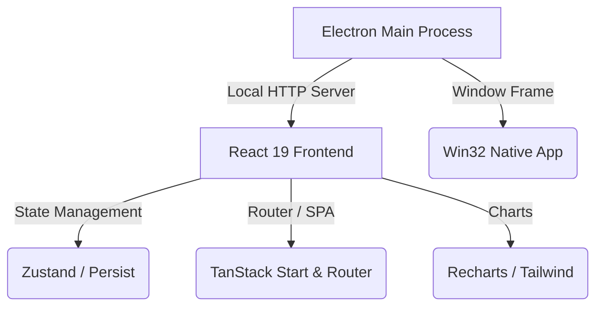

# 🌌 Capital OS — Vanguard Edition

> **Personal Financial Operating System.** Runs 100% offline, storing data locally on your device with complete privacy.

Capital OS is a state-of-the-art desktop dashboard built to help individuals plan, simulate, and track their financial path to zero debt and wealth accumulation. By combining local storage persistence with predictive calculation models, it offers real-time forecasting and cash waterfall planning completely offline.

---

## 🎨 Visual Preview & Design Philosophy
Capital OS features a premium dashboard layout based on:
*   **Minimalist Glassmorphism**: Clean obsidian dark-mode interface with elegant mint and emerald accent elements.
*   **Unified Component Hierarchy**: Responsive sidebar navigation, real-time responsive analytics charts, and action tables.
*   **Local Privacy**: No external databases, API trackers, or server synchronization. Your financial history resides entirely on your local machine.

---

## 🚀 Key Modules & Features

### 📅 1. Monthly Planner & Cash Waterfall
*   **Waterfall Allocations**: Automatically routes your monthly income sources down to savings, investments, mandatory bills, and surplus cash allocations.
*   **Payment Checklist**: Dynamic list to track what has been paid for the active month (bills, credit cards, or loans) with persistent state.
*   **Due-Date Calendar**: Visual grid showcasing exact billing timelines to keep you ahead of interest fees.

### 🔮 2. Forecast Engine (Path to Zero)
*   **Debt Simulation Algorithms**: Compares **Debt Snowball** (lowest balance first) against **Debt Avalanche** (highest APR first) dynamically.
*   **Extra Payment Routing**: Simulate how adding extra monthly payments accelerates your debt-free timeline.
*   **Payoff Projections**: Computes exact payment timelines, total interest saved, and dates when you will achieve 100% financial freedom.

### 💼 3. Complete Portfolio Tracking
*   **Assets & Liabilities**: Visual charts tracking real estate, investments, bank balances, against credit limits and outstanding loans.
*   **Net Worth Calculator**: Real-time asset-minus-liability calculations reflecting your overall portfolio valuation.

---

## 🛠️ Tech Stack & Architecture



*   **Core**: React 19, TypeScript, Vite
*   **Router**: TanStack Start & TanStack Router (configured in SPA static mode)
*   **State**: Zustand with local storage persistence
*   **Desktop Wrapper**: Electron with static HTTP-fallback server (allowing deep route links)
*   **Styles**: Tailwind CSS with custom variables

---

## 📦 Getting Started & Commands

### Development
Launch the local web dev server:
```bash
bun run dev
```

Launch the desktop environment in live development mode:
```bash
bun run electron:dev
```

### Production Desktop Packaging
1.  **Format and Quality Check**:
    ```bash
    bun run format
    bun run lint
    ```
2.  **Compile & Package**:
    ```bash
    bun run electron:pack:win
    ```
    This command builds static SPA files (`bun run build:desktop`) and packages a portable Windows client to `electron-release/`.

---

## ℹ️ Troubleshooting & Releases

### Why are the compiled `.exe` files not committed to this git branch?
GitHub restricts individual file sizes to **100 MB** max. Because the packaged `.exe` (under `electron-release/`) is approximately **225 MB**, attempting to push it directly via git triggers a timeout or network disconnect (e.g. `RPC failed; HTTP 408` or `unexpected disconnect`). 

To share or download compiled builds:
1.  **GitHub Releases**: Upload the packaged `.exe` (or a compressed `.zip` of the `electron-release/` folder) to the **Releases** section of your GitHub repository.
2.  **Git LFS**: Install Git Large File Storage (LFS) if you strictly need to track the binaries on GitHub branches.
