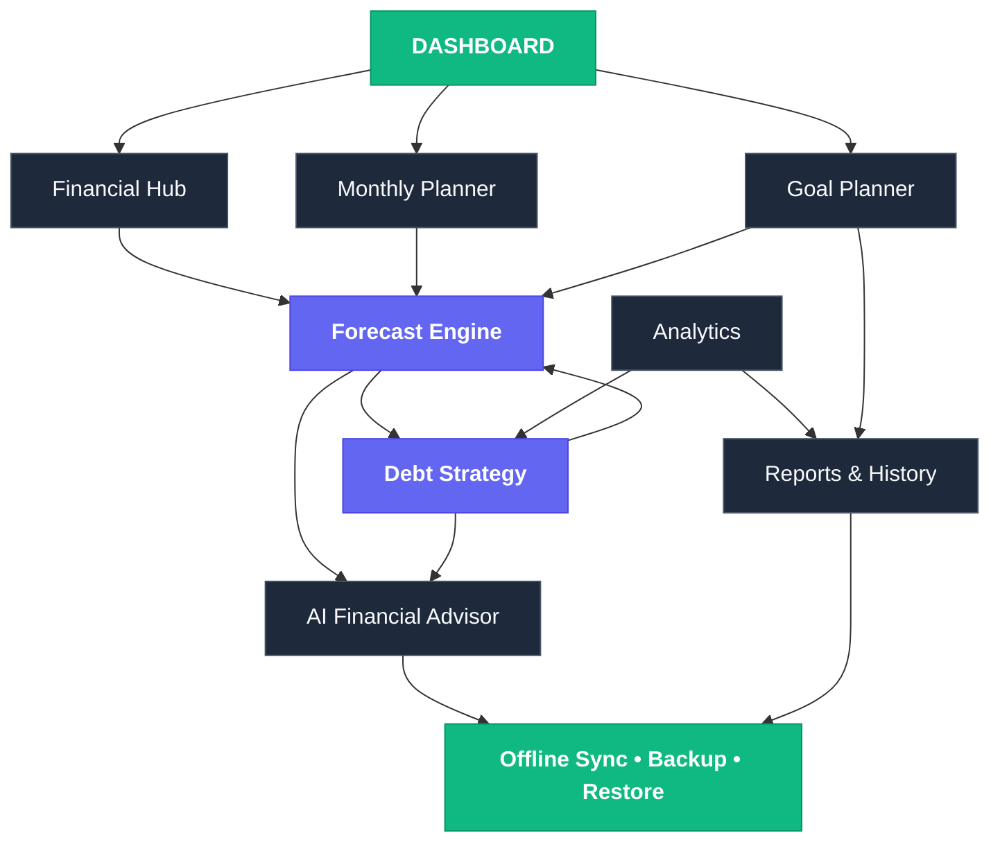
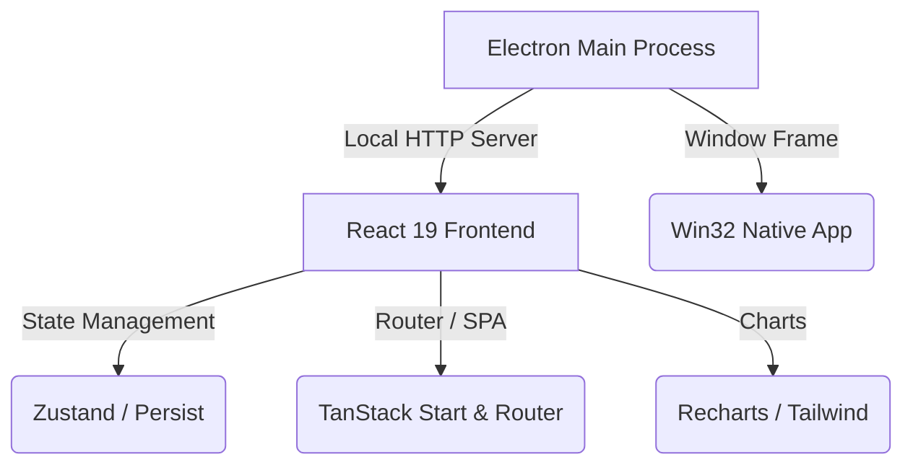

# 🌌 Capital OS — Vanguard Edition

> **Personal Financial Operating System.** Runs 100% offline, storing data locally on your device with complete privacy.

Capital OS is a state-of-the-art desktop dashboard built to help individuals plan, simulate, and track their financial path to zero debt and wealth accumulation. By combining local storage persistence with predictive calculation models, it offers real-time forecasting and cash waterfall planning completely offline.

---

## 🎨 Visual Preview & Design Philosophy
Capital OS features a premium dashboard layout based on:
*   **Minimalist Glassmorphism**: Clean obsidian dark-mode interface with elegant mint and emerald accent elements.
*   **Unified Component Hierarchy**: Responsive sidebar navigation, real-time responsive analytics charts, and action tables.
*   **Local Privacy**: No external databases, API trackers, or server synchronization. Your financial history resides entirely on your local machine.

---

## 🚀 Key Modules & Features

### 📅 1. Monthly Planner & Cash Waterfall
*   **Waterfall Allocations**: Automatically routes your monthly income sources down to savings, investments, mandatory bills, and surplus cash allocations.
*   **Payment Checklist**: Dynamic list to track what has been paid for the active month (bills, credit cards, or loans) with persistent state.
*   **Due-Date Calendar**: Visual grid showcasing exact billing timelines to keep you ahead of interest fees.

### 🔮 2. Forecast Engine (Path to Zero)
*   **Debt Simulation Algorithms**: Compares **Debt Snowball** (lowest balance first) against **Debt Avalanche** (highest APR first) dynamically.
*   **Extra Payment Routing**: Simulate how adding extra monthly payments accelerates your debt-free timeline.
*   **Payoff Projections**: Computes exact payment timelines, total interest saved, and dates when you will achieve 100% financial freedom.

### 💼 3. Complete Portfolio Tracking
*   **Assets & Liabilities**: Visual charts tracking real estate, investments, bank balances, against credit limits and outstanding loans.
*   **Net Worth Calculator**: Real-time asset-minus-liability calculations reflecting your overall portfolio valuation.

---

## 🗺️ Product Roadmap & Architecture

### Master Product Flow


### Core Architecture
```
Financial Operating System
├── Dashboard (Overview & Core Metrics)
├── Financial Hub
│   ├── Income (Salary, Side, Bonus, expected)
│   ├── Bills (Utility, Subscriptions, Auto Pay)
│   ├── Debts (EMIs, BNPL, Personal/Bank loans)
│   ├── Credit Lines (Cards, Overdraft, limits)
│   ├── Savings (Emergency fund, Goal milestones)
│   ├── Investments (SIPs, Stocks, Crypto, Mutual Funds)
│   └── Assets (Property, Gold, Vehicles, Bank balances)
├── Monthly Planner (Waterfall, Checklist, Calendar)
├── Forecast Engine (Multi-month projections, Scenarios)
├── Debt Strategy (Snowball, Avalanche, Smart Mix)
├── Goal Planner
├── Analytics
├── Reports
├── AI Advisor
├── History
└── Settings
```

---

### Implementation Phases (Roadmap)
Below is the 15-phase implementation plan detailing the vision from core foundation to long-term automation:

<details>
<summary><b>Phase 1 — Foundation (Current Build)</b></summary>

*   **Dashboard Widgets**: Available cash, commitments, Net Worth, debt remaining, timeline, and dynamic Financial Health Score.
*   **Income Tracking**: Salary, side income, recurring, and variable sources.
*   **Bills Management**: Recurring, variable, utilities, and auto-pay tags.
*   **Liability Tracking**: Outstanding loans (personal, bank, friends), EMIs, and credit limits.
*   **Savings & Investments**: SIPs, mutual funds, stocks, crypto, property, and cash assets.
</details>

<details>
<summary><b>Phase 2 — Monthly Planning</b></summary>

*   **Workspace Flow**: Income → Mandatory Bills → Debts → Savings → Lifestyle allocation workspace.
*   **Planning Interface**: Monthly calendar grid, due date reminders, checklist, and cash flow timeline.
</details>

<details>
<summary><b>Phase 3 — Forecast Engine</b></summary>

*   **Projections**: Generate 1, 3, 6, 12-month projections of cash flow, savings, net worth, and debt-free target dates.
*   **Scenario Simulator**: "What if" sandbox (e.g., salary change, unexpected bills, extra payments, loan closures).
</details>

<details>
<summary><b>Phase 4 — Debt Strategy</b></summary>

*   **Algorithms**: Debt Snowball (lowest balance first) vs. Debt Avalanche (highest APR first).
*   **Smart Strategy Mix**: Automated calculations targeting minimum interest, penalty protection, and credit score optimization.
</details>

<details>
<summary><b>Phase 5 — Goal Planner</b></summary>

*   **Track Milestones**: Milestones for emergency funds, vacations, assets, and overall debt freedom.
*   **Estimates**: Computes exact timelines based on current monthly contribution configurations.
</details>

<details>
<summary><b>Phase 6 — Analytics</b></summary>

*   **Visualizations**: Sankey flow diagrams, Waterfall cash flow charts, calendar heatmaps, and trendlines.
*   **Trends**: Debt timeline curves, savings growth trajectories, and goal completion rates.
</details>

<details>
<summary><b>Phase 7 — AI Advisor (Financial Coach)</b></summary>

*   **Scenario Queries**: Ask queries like *"Can I buy a bike?"*, *"Should I invest this month?"*, or *"Which debt should I pay first?"*.
*   **Actionable Output**: Runs simulations behind the scenes and returns clear recommendations and impact summaries.
</details>

<details>
<summary><b>Phase 8 — Reports</b></summary>

*   **Exports**: Export monthly financial statements, net worth reviews, and strategy audits.
*   **Formats**: Save or share as PDF, Excel, CSV, or JSON.
</details>

<details>
<summary><b>Phase 9 — History</b></summary>

*   **Timeline Snapshots**: Browse previous months' payment registries, completed milestones, and archived data snapshots.
</details>

<details>
<summary><b>Phase 10 — Offline PWA & Data Portability</b></summary>

*   **Database**: Local IndexedDB browser-side storage.
*   **Backups**: Auto-backups and manual JSON export/import.
</details>

<details>
<summary><b>Phase 11 — Intelligence Engine</b></summary>

*   **Automated Metrics**: Debt-to-income ratio, emergency readiness scores, stability factors, and credit utilization alerts.
</details>

<details>
<summary><b>Phase 12 — Automation</b></summary>

*   **Schedulers**: Automatic recurring transaction logging, automated monthly archives, and payment/goal warnings.
</details>

<details>
<summary><b>Phase 13 — Mobile Experience</b></summary>

*   **Mobile Interface**: Swipe-to-pay, quick floating add buttons, home widgets, and voice inputs.
</details>

<details>
<summary><b>Phase 14 — Settings & Security</b></summary>

*   **Customization**: Currency types, financial cycles, themes, and biometric or PIN lock capabilities.
</details>

<details>
<summary><b>Phase 15 — Future Expansion</b></summary>

*   **Advanced Tools**: Family shared plans, multi-account integrations, OCR receipt scanner, tax estimators, and companion app widgets (Wear OS/Apple Watch).
</details>

---

## 🛠️ Tech Stack & Architecture



*   **Core**: React 19, TypeScript, Vite
*   **Router**: TanStack Start & TanStack Router (configured in SPA static mode)
*   **State**: Zustand with local storage persistence
*   **Desktop Wrapper**: Electron with static HTTP-fallback server (allowing deep route links)
*   **Styles**: Tailwind CSS with custom variables

---

## 📦 Getting Started & Commands

### Development
Launch the local web dev server:
```bash
bun run dev
```

Launch the desktop environment in live development mode:
```bash
bun run electron:dev
```

### Production Desktop Packaging
1.  **Format and Quality Check**:
    ```bash
    bun run format
    bun run lint
    ```
2.  **Compile & Package**:
    ```bash
    bun run electron:pack:win
    ```
    This command builds static SPA files (`bun run build:desktop`) and packages a portable Windows client to `electron-release/`.

---

## ℹ️ Troubleshooting & Releases

### Why are the compiled `.exe` files not committed to this git branch?
GitHub restricts individual file sizes to **100 MB** max. Because the packaged `.exe` (under `electron-release/`) is approximately **225 MB**, attempting to push it directly via git triggers a timeout or network disconnect (e.g. `RPC failed; HTTP 408` or `unexpected disconnect`). 

To share or download compiled builds:
1.  **GitHub Releases**: Upload the packaged `.exe` (or a compressed `.zip` of the `electron-release/` folder) to the **Releases** section of your GitHub repository.
2.  **Git LFS**: Install Git Large File Storage (LFS) if you strictly need to track the binaries on GitHub branches.
